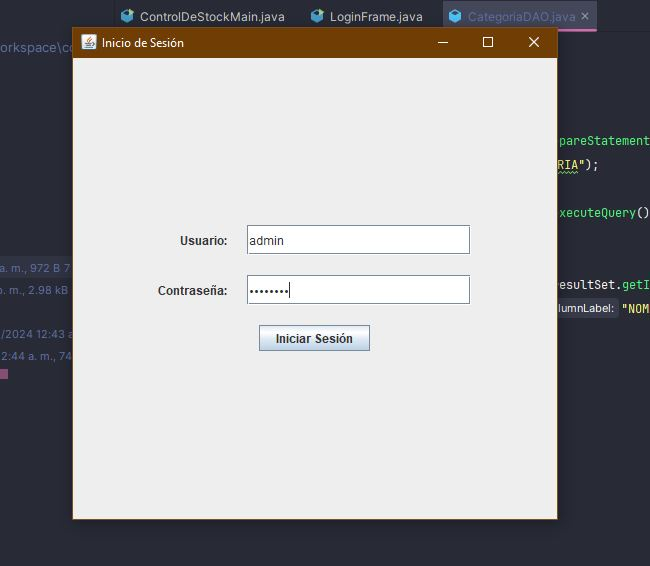
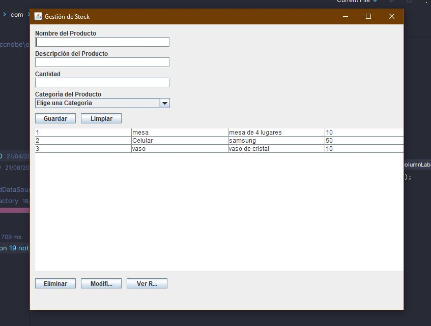

# Control de Stock - Proyecto Java y SQL con Login

## Descripción
Este repositorio contiene el código fuente de un sistema de control de stock desarrollado en Java, con una base de datos MySQL. Durante su desarrollo, se han implementado operaciones clave en SQL, configurado y gestionado la base de datos localmente, optimizado conexiones utilizando C3P0, colaborado eficientemente mediante GitHub para el control de versiones y añadido funcionalidades de login para mayor seguridad.

## Características Destacadas
- **Operaciones en la Base de Datos:**
  - Implementación de operaciones como SELECT, INSERT, UPDATE y DELETE para la gestión de datos.

- **Gestión Local de Datos:**
  - Configuración y administración de la base de datos MySQL en un entorno local.

- **Optimización de Conexiones:**
  - Utilización de C3P0 para mejorar la eficiencia en las conexiones a la base de datos.

- **Colaboración Efectiva con GitHub:**
  - Trabajo en equipo eficiente utilizando GitHub para el control de versiones.

- **Login de Usuario:**
  - Implementación de funcionalidades de login para mejorar la seguridad del sistema.
  
## Capturas de Pantalla
- **Login:**
  
  
- **Menú Principal:**
  

- **Resolución de Problemas en Consultas:**
  - Identificación y resolución de problemas, mejorando la eficiencia en consultas de datos.
  
## Instrucciones de Uso
Para ejecutar el sistema de control de stock, sigue los siguientes pasos:

1. [Configuración del entorno y dependencias]
2. [Instrucciones para la ejecución]

## Contribuciones
Las contribuciones son bienvenidas. 
